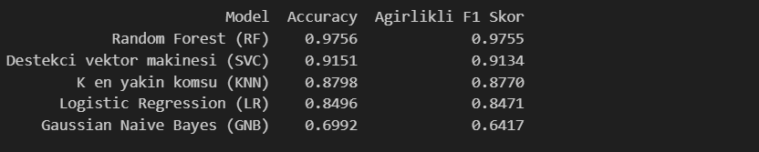
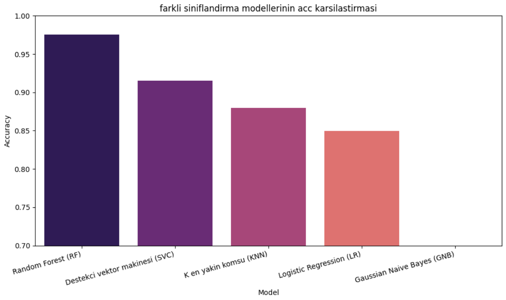
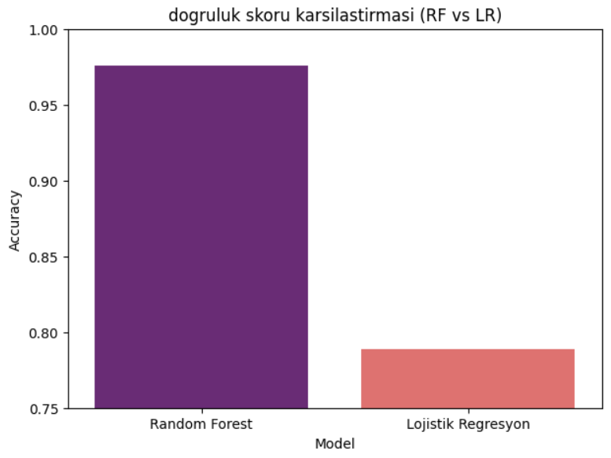
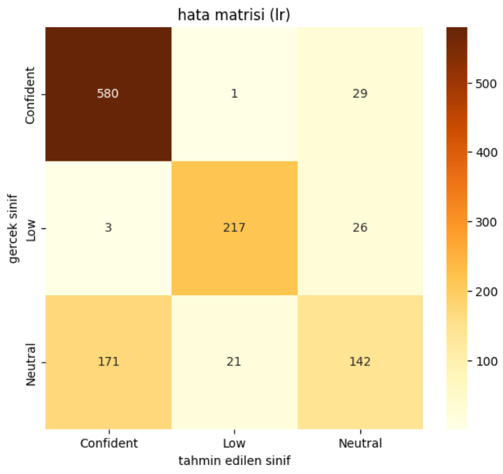

# ML-Project-Confidence-Detection

#  Makine Öğrenmesi Projesi: Beden Dili ile Güven Tespiti (Confidence Detection)

Bu proje, Kaggle veri setini kullanarak, bir kişinin duruşu ve pozisyonu üzerinden güven seviyesini (**Confident, Neutral, Low**) tahmin etmeyi amaçlayan bir **Çoklu Sınıflandırma (Multi-Class Classification)** projesidir.
---

## 1. Veri Seti ve Keşifçi Veri Analizi (EDA)

### A. İşlem Gerekçeleri ve Veri Kontrolü

| İşlem | Yapılma Nedeni | Etkisi  |
| :--- | :--- | :--- |
| **`df.info()` Kontrolü** | **Eksik (Null) değer** olmadığını ve veri tiplerinin modellemeye uygunluğunu kontrol etmek için. | Veri setinin temizlik işlemine gerek kalmadığı görüldü. |
| **Sınıf Dağılım Grafiği** | Hedef sınıflar arasındaki **veri dengesizliğini** kontrol etmek. | Dağılım dengeli. **Etkisi:** Modelin herhangi bir sınıfa **yanlılık** gösterme riski azaltıldı. |
| Korelasyon Matrisi (Sayısal) | Tüm sayısal özellikler arasındaki **doğrusal ilişki gücünü test etmek.** | **Etkisi:** Çoğu özellik arasında zayıf doğrusal korelasyon olduğu görüldü. **Lojistik Regresyon** gibi doğrusal modellerin yetersiz kalacağını öngörmemi sağladı. |
| **Box/Violin Plot** | Kritik özelliklerin sınıflar arasında ayrım gücünü görsel olarak test etmek için. | **Etkisi:** Özelliklerin sınıfları ayırma potansiyeline sahip olduğu öngörüldü, bu da doğruluk skorunu destekleyen kanıt oldu. |
| Kolon Çıkarma Kararı | İlk denemede yüksek performans elde edildiği için düşük korelasyon sebebiyle hiçbir kolon çıkarılmamıştır. | - |

* **Sınıf Dağılımı (Bar Plot):**

### B. Korelasyon Testi ve Özellik Kararları

| Korelasyon Test Yöntemi | Yapılma Nedeni | 
| :--- | :--- | 
| **Box/Violin Plot** | Önemli sayısal özelliklerin sınıflar arasında ayrım gücünü görsel olarak test etmek için. | 
| **Pair Plot** | Çoklu değişkenler arasındaki ilişkilerin sınıflara göre nasıl ayrıldığını görsel olarak test edebilme için. | 
| **Feature Importance** | Bir özelliğin hedef değişkenle olan tahmin edici gücünü belirleyerek, en güçlü ilişkiye sahip özellikleri kanıtlamaya. | 

* **Kritik Özellik Dağılımı (Violin Plot):**
    

* **Özellikler Arası İlişkiler (Pair Plot):**
          

---

## 2. Veri Ön İşleme (Preprocessing)

| İşlem | Yapılma Nedeni (Gerekçesi) | Etkisi (Analiz Sonucu) |
| :--- | :--- | :--- |
| **One-Hot Encoding** | **Kategorik metin** verilerini modelin anlayacağı **sayısal (ikili)** formata dönüştürme için. | **Etkisi:** Modelin, her bir spesifik beden dili kategorisini bağımsız bir kural olarak kullanmasını sağladı. |
| **Label Encoding** | Üç farklı etiketi modelin anlayacağı 0, 1, 2 gibi sayısal hedeflere dönüştürme. | **Etkisi:** Sınıflandırma modelinin tahmin çıktılarını standartlaştırdı.. |
| **StandardScaler** | **LR, SVC, KNN** gibi mesafe tabanlı modeller için özellik değerlerini standart aralığa getirebilme. | **Etkisi:** Modellerin doğru yakınsama sağlamasını ve performanslarının adil karşılaştırılmasını sağladı. |
| **Train-Test Split** | Modelin genelleme yeteneğini test etme. | **Etkisi:** Yüksek doğruluğun görülmemiş veride geçerli olduğunu kanıtladı ve ezberleme olmadığını gösterdi. |

---

## 3. Kapsamlı Model Karşılaştırması ve Eğitimi

### A. Modelin Uygunluğu Gerekçesi

| Özellik | **Random Forest (RF)** | **Destekçi Vektör (SVC)** | **Lojistik Regresyon (LR)** | **GNB** |
| :--- | :--- | :--- | :--- | :--- |
| **Problem Tipi** | **Sınıflandırma** (Non-linear) | **Sınıflandırma** (Non-linear/Mesafe) | **Sınıflandırma** (Linear) | **Sınıflandırma** (Basit Olasılık) |
| **Accuracy Skoru** | **%97.56** | %91.51 | %84.96 | %69.92 |
| **Gerekçe** | **En Stabil ve En Yüksek Doğruluk.** Non-lineer karmaşık ilişkileri yakaladı. | Yüksek skor almasına rağmen, performansı RF'in gerisinde kaldı. | **Doğrusal olmayan veride yetersiz kaldı.** | Veri karmaşıklığını yakalayamadı. |

**Random Forest (RF)** modeli, **%97.56** doğrulukla tüm modeller arasında en iyi sonucu vermiştir.
 
**Doğrusal Olmayan İlişkiler:** LR, KNN, SVC ve GNB gibi diğer modellerin aldığı düşük skorlar, beden dili verilerindeki ilişkilerin kesinlikle doğrusal veya basit olmadığını ispatlamıştır.

Random Forest, beden dili verisinin karmaşık (non-lineer) yapısını yakaladığı için üstünlük sağladığını buradan anlıyoruz.

---

## 4. Genel Sonuclar ve Değerlendirme

### A. Model Performansları

   
 

| Metrik | Sonuç | Yorum |
| :--- | :--- | :--- |
| **Doğruluk (Accuracy)** | **%97.56** | Model, test verisinin yüksek oranda doğru sınıflandırmıştır. |
    
   
   
* **RFveLR-Hata Matrisi (Confusion Matrix):**

   
   
    
  
### B. Özellik Önem Sıralaması

* **Feature Importance:**

    

   Modelin kararına en çok etki eden özellikler: **`shoulder_span`**, **`wrist_distance_x`** ve **`eye_distance_ratio`** gibi **vücut oranları ve duruşla** ilgili özelliklerdir.

### C. Genel Sonuç

Bu proje, **Random Forest** modeli kullanarak beden dili verilerinden güven seviyesini tahmin etme görevinde **%97.56** gibi bir başarı elde etmiştir. Geliştirilen modelin analizi ve **Feature Importance** bulguları, güven seviyesinin belirlenmesinde en kritik bilginin **duruş ve vücut oranlarından** geldiğini kanıtlamaktadır. 
