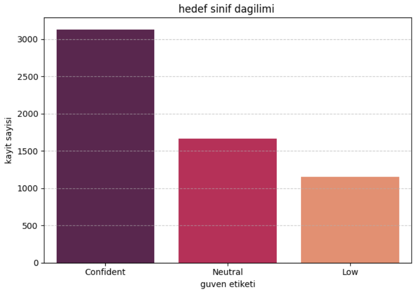
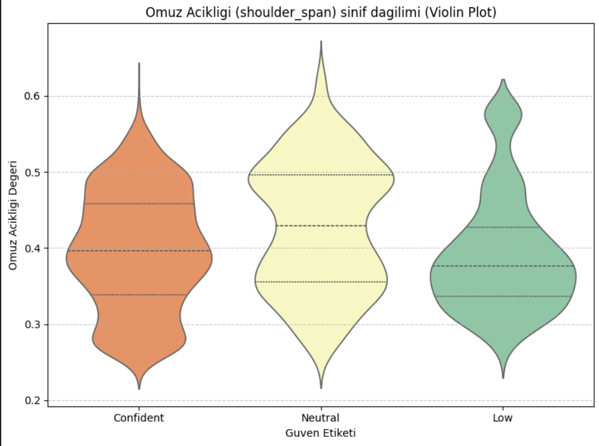
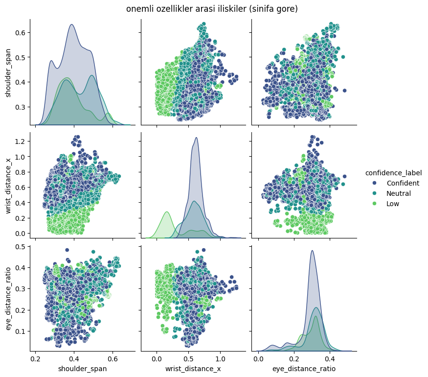
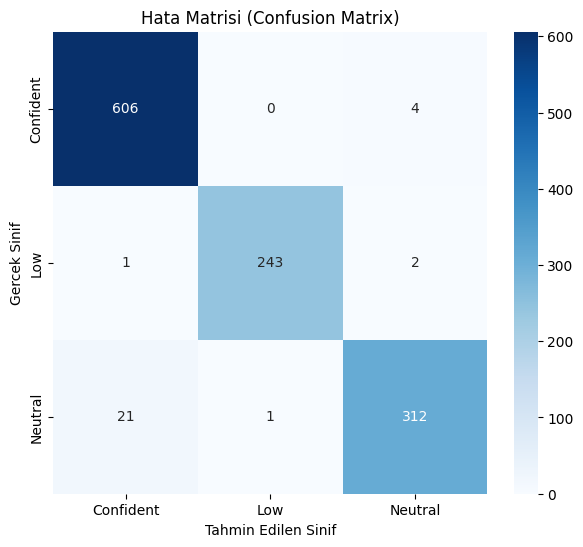
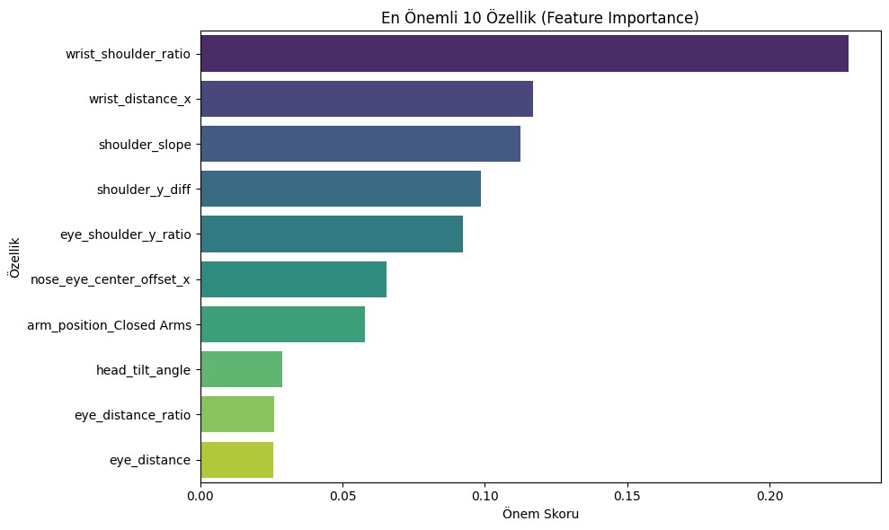

# ML-Project-Confidence-Detection

#  Makine Öğrenmesi Projesi: Beden Dili ile Güven Tespiti (Confidence Detection)

Bu proje, Kaggle veri setini kullanarak, bir kişinin duruşu ve pozisyonu üzerinden güven seviyesini (**Confident, Neutral, Low**) tahmin etmeyi amaçlayan bir **Çoklu Sınıflandırma (Multi-Class Classification)** projesidir.
---

## 1. Veri Seti ve Keşifçi Veri Analizi (EDA)

### A. İşlem Gerekçeleri ve Veri Kontrolü 

| İşlem | Yapılma Nedeni (Gerekçesi) | 
| :--- | :--- |
| **`df.info()` Kontrolü** | **Eksik (Null) değer** olup olmadığını ve veri tiplerinin modellemeye uygunluğunu kontrol etmek için. | 
| **Sınıf Dağılım Grafiği** | Hedef sınıflar arasındaki **veri dengesizliğini (imbalance)** kontrol etmek. Modelin başarısını gerekçelendirmek içib. | 
| Korelasyon Matrisi (Sayısal) | Tüm sayısal özellikler arasındaki **doğrusal ilişki gücünü somut olarak test etmek.**  **Etkisi:** Çoğu özellik arasında **zayıf doğrusal korelasyon** olduğu görüldü. **Lojistik Regresyon** gibi doğrusal modellerin yetersiz kalacağını öngörmemizi sağladı. |
| **Box/Violin Plot** | Kritik özelliklerin sınıflar arasında **ayrım gücünü görsel olarak test etmek**.  **Etkisi:** Özelliklerin sınıfları başarıyla ayırma potansiyeline sahip olduğu öngörüldü, bu da **yüksek doğruluk** skorunu destekleyen temel kanıt oldu. |
| Kolon Çıkarma Kararı | İlk denemede yüksek performans elde edildiği için **düşük korelasyon sebebiyle hiçbir kolon çıkarılmamıştır**. | 

* **Sınıf Dağılımı (Bar Plot):**

### B. Korelasyon Testi ve Özellik Kararları

| Korelasyon Test Yöntemi | Yapılma Nedeni | Kolon Çıkarma Kararı |
| :--- | :--- | :--- |
| **Box/Violin Plot** | Önemli sayısal özelliklerin sınıflar arasında ayrım gücünü **görsel olarak test etmek** (Korelasyon analizi). | İlk denemede yüksek performans elde ettiğim için **düşük korelasyon nedeniyle hiçbir kolon çıkarmadım**. |
| **Pair Plot** | Çoklu değişkenler arasındaki ilişkilerin sınıflara göre nasıl ayrıldığını **görsel olarak test etme** . | - |
| **Feature Importance** | Bir özelliğin hedef değişkenle olan **tahmin edici gücünü** belirleyerek, en güçlü ilişkiye sahip özellikleri kanıtlama. | - |

* **Kritik Özellik Dağılımı (Violin Plot):**
    

* **Özellikler Arası İlişkiler (Pair Plot):**
          

---

## 2. Veri Ön İşleme (Preprocessing)

| İşlem | Yapılma Nedeni (Gerekçesi) |
| :--- | :--- |
| **One-Hot Encoding** | **Kategorik metin** verilerini modelin anlayacağı **sayısal (ikili)** formata dönüştürme. Etkisi: Modelin, her bir spesifik beden dili kategorisini bağımsız bir kural olarak kullanmasını sağladı. |
| **Label Encoding** | Üç farklı etiketi modelin anlayacağı **0, 1, 2** gibi sayısal hedeflere dönüştürme. |
| **Train-Test Split** | Modelin genelleme yeteneğini test etmek. Etkisi: Yüksek doğruluğun görülmemiş (unseen) veride geçerli olduğunu kanıtladı ve ezberleme (overfitting) olmadığını gösterdi.|

---

## 3. Model Seçimi ve Eğitimi

### A. Modelin Uygunluğu Gerekçesi 

| Özellik | Random Forest (Seçilen) | Linear Regression (Uygun Değil) |
| :--- | :--- | :--- |
| **Problem Tipi** | **Sınıflandırma** (Etiket Tahmini) | Regresyon (Sürekli Sayı Tahmini) |
| **Uygunluk** | Kategorik etiketler için ideal. | Sayısal tahminler için uygun. |

 Hedef değişkenimizin **kategorik etiketler** olması nedeni ile, **Random Forest Sınıflandırıcı** modelini tercih ettim. Bu model, yüksek doğruluk ve kararlılık sunarak projenin gerekliliklerini  iyi şekilde karşıladı.

---

## 4. Model Değerlendirme ve Genel Sonuç

### A. Model Performansı

| Metrik | Sonuç | Yorum |
| :--- | :--- | :--- |
| **Doğruluk (Accuracy)** | **%97.56** | Model, test verisinin yüksek oranda doğru sınıflandırmıştır. |

* **Hata Matrisi (Confusion Matrix):**

   

   Matris, modelin **üç sınıfı da** çok düşük hata oranıyla ayırt ettigini gösteriyor.

### B. Özellik Önem Sıralaması

* **Feature Importance:**

    

   Modelin kararına en çok etki eden özellikler: **`shoulder_span`**, **`wrist_distance_x`** ve **`eye_distance_ratio`** gibi **vücut oranları ve duruşla** ilgili özelliklerdir.

### C. Genel Sonuç

Bu proje, **Random Forest** modeli kullanarak beden dili verilerinden güven seviyesini tahmin etme görevinde **%97.56** gibi bir başarı elde etmiştir. Geliştirilen modelin analizi ve **Feature Importance** bulguları, güven seviyesinin belirlenmesinde en kritik bilginin **duruş ve vücut oranlarından** geldiğini kanıtlamaktadır. 
